### Escuela Colombiana de Ingeniería
### Arquitecturas de Software - ARSW
### Laboratorio - Escalamiento con balanceo de carga
- Inicie ambas máquinas y verifique que queden con sus respectivas direcciones, y que éstas sean accesibles.

	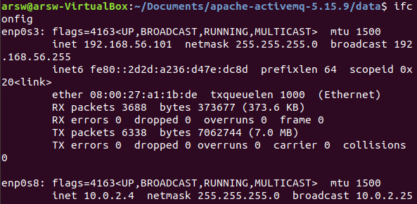
	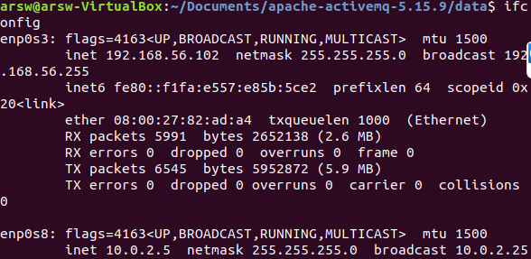

- Realizamos ping a cada dirección desde la máquina real para verficar que son accesibles.

	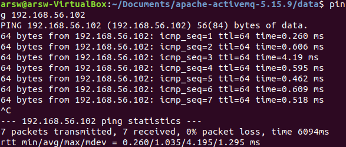
	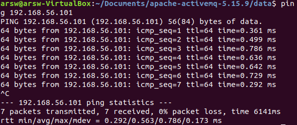
	
##### Parte 1
- Al haber usado la aplicación, consulte nuevamente la consola Web de ActiveMQ, y revise qué información de tópicos se ha mostrado.

	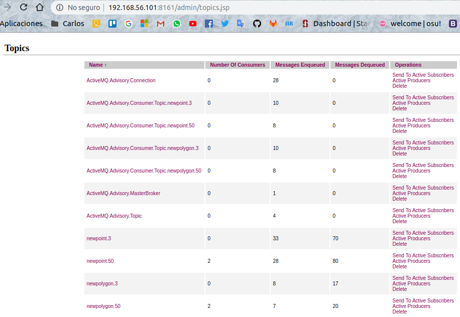
Al acceder a la aplicación con la url de cada servidor, se puede ver que en la página de ActiveMQ aparecen las conexiones y los tópicos a los que se suscribieron los clientes:

	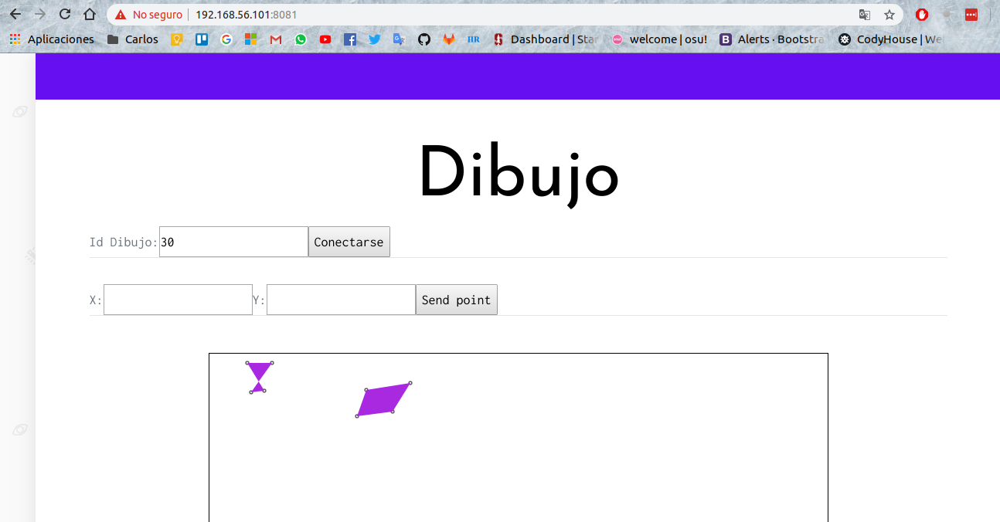
	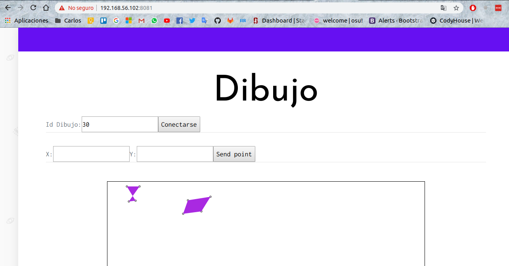
	
##### Parte 2
- El servidor que se escogió como responsable del balanceo de carga fue 192.168.56.102, en el que se agregó un archivo de configuración de nginx
- Desde un navegador, abra la URL de la aplicación, pero usando el puerto del balanceador de carga (8090). Verifique el funcionamiento de la aplicación.

	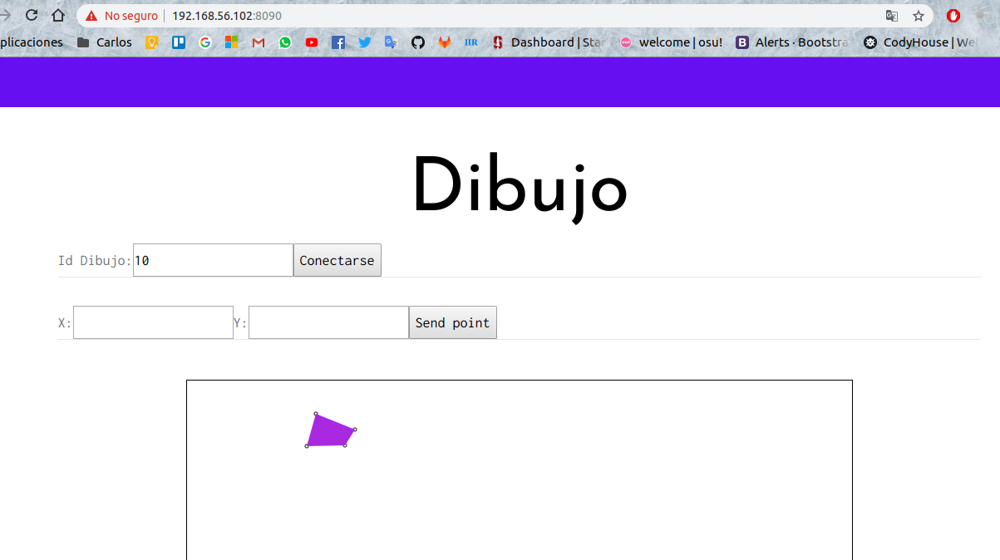

- Después de implementar el balanceo de carga de tipo 'least_conn' se probó nuevamente la aplicación desde diferentes navegadores.

	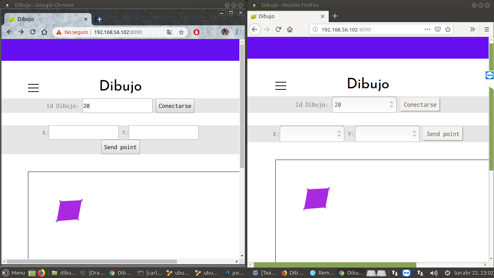

Aqui podemos ver el archivo de configuración creado para que permita el balanceo de carga:
	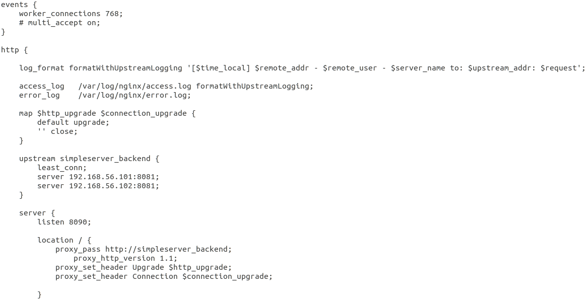

Este archivo se encuentra en la dirección **/home/arsw/Documents/nginx-balanceo.conf**

- Ahora podemos entrar a los logs de nginx, en este caso al archivo access.log, de manera que podamos observas cómo se envían a cada uno de las aplicaciones las peticiones.

	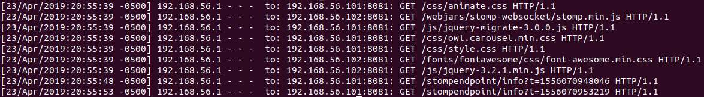

- Cuando apagamos la aplicación en el servidor con ip 192.168.56.102, las peticiones cuando se enviaban a este, no se respondian y se redireccionaban a la aplicación del del servidor con ip 192.168.56.101, y en general, sólo eran enviadas a este último.

	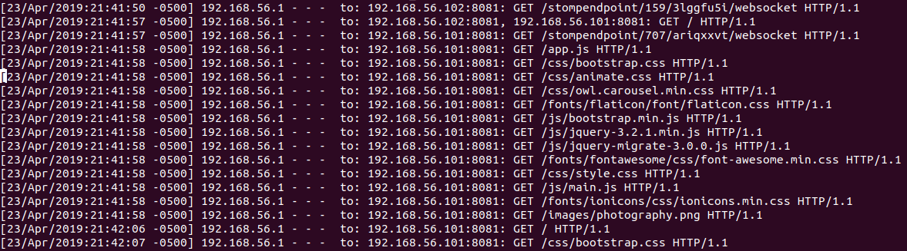
	
- Para no tener "quemados" datos del host y el puerto, realizamos la configuración para que tomara los datos del archivo application.properties.

	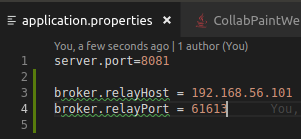
	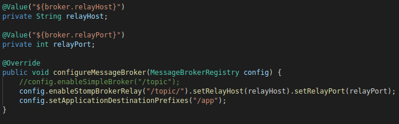

##### Parte 3
- Luego de haber cambiado de activeMQ a CloudAMQP como broker de mensajes, podemos ver en el administrador los topics creados.

	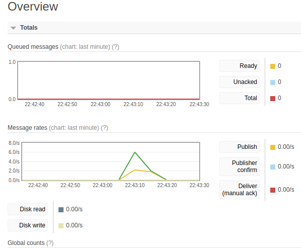CloudAMQP2.png
	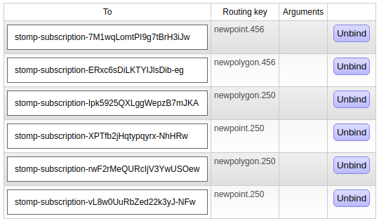
	
- Consulte 'benchmarks' comparativos entre RabbitMQ y ActiveMQ, y analice cual sería más conveniente.

	<table><thead><th></th><th>ActiveMQ</th><th>RabbitMQ</th></thead><tbody><th>Diferencias</th><td> - Es un intermediario de mensajes open source. - Es escalable. - Es persistente. - Otorga una alta disponibilidad.
- No permite total control del lado de la aplicación, por lo que sólo es posible configurar en el lado del agente. - Mantiene un orden en los mensajes y además permite concurrencia. - Otorga consistencia en los mensajes recibidos.</td><td>- El intercambio de letras muertas puede realizarse desde la aplicación sin tenerlo que hacer. - Usa un nodo central para recibir los mensajes antes de enviarselos a los clientes. - Es menos escalable y a veces más lento pues por el nodo central añade latencia.</td></tbody></table>

Por la forma en que los clientes deben dibujar en la aplicación, es necesario que sea de manera concurrente y que exista consistencia al pintar los puntos y dibujar los polígonos. Además también debe poder persisirlos para que después de un número de puntos genere el polígono. Por estas y demás razones, la mejor opción es **ActiveMQ**, aunque si la cantidad de clientes no es mucha, RabbitMQ puede ser una opción, teniendo en cuenta que este no garantiza consistencia, pero los mensajes no se pierden.